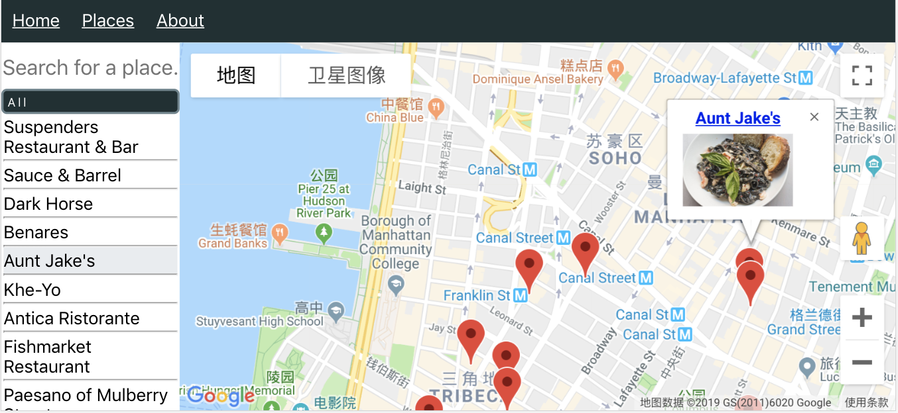

# googlemap-react

[](#contributors)

[](https://www.npmjs.com/package/@googlemap-react/core)
[](https://opensource.org/licenses/MIT)
[](https://codecov.io/gh/googlemap-react/googlemap-react)
[](https://codebeat.co/projects/github-com-googlemap-react-googlemap-react-master)

[](https://spectrum.chat/googlemap-react)

Easier Google Map Integration for React projects.

[READ THE DOC](https://doc.googlemap-react.com)

## Why a new package

There has been similar packages such as
[tomchentw/react-google-maps](https://github.com/tomchentw/react-google-maps),
[google-map-react/google-map-react](https://github.com/google-map-react/google-map-react),
[fullstackreact/google-maps-react](https://github.com/fullstackreact/google-maps-react),
so why bother writing a new library?

The aim is to make an easier-to-use Google Map library for React users,
empowered by `React`'s latest features (`React >= 16.8.0` is required) and
`TypeScript`.

## What is different

- Component position is free (generally)
- Direct access to Google Map objects
- More uniform API
- Type safe

## Example usage

### Prerequisites

- npm or yarn

```sh
yarn add @googlemap-react/core
# Or you can use
npm install --save @googlemap-react/core
```

- a valid Google Map API key (to replace the place holder in the code snippet
  below)

```javascript
import {
  GoogleMapProvider,
  HeatMap,
  InfoWindow,
  MapBox,
  Marker,
  Polygon,
} from '@googlemap-react/core'

// In your component
return (
  <GoogleMapProvider>
    <MapBox
      apiKey="YOUR_GOOGLE_MAP_API_KEY"
      opts={{
        center: {lat: 39, lng: 116},
        zoom: 14,
      }}
      style={{
        height: '100vh',
        width: '100%',
      }}
      useDrawing
      useGeometry
      usePlaces
      useVisualization
      onCenterChanged={() => {
        console.log('The center of the map has changed.')
      }}
    />
    <Marker
      id="marker"
      opts={{
        draggable: true,
        label: 'hello',
        position: {lat: 39, lng: 116},
      }}
    />
    <InfoWindow
      opts={{
        content: 'This is an info window',
        position: {lat: 39.01, lng: 115.99},
      }}
      visible
    />
    <Polygon
      id="polygon"
      opts={{
        path: [
          {lat: 38.98, lng: 116.01},
          {lat: 38.98, lng: 116.03},
          {lat: 38.99, lng: 116.03},
        ],
        strokeColor: 'cyan',
      }}
    />
    <HeatMap
      opts={{
        data: [
          {lat: 38.982, lng: 116.037},
          {lat: 38.982, lng: 116.035},
          {lat: 38.985, lng: 116.047},
          {lat: 38.985, lng: 116.045},
        ],
      }}
    />
    <OverlayView position={{lat: 39, lng: 116}}>
      <h2>⚑ This is a custom overlay 🙌</h2>
    </OverlayView>
  </GoogleMapProvider>
)
```

For more detailed explanation, see the [doc](https://doc.googlemap-react.com).

## Advanced usage

Instead of using the pre-designed components, you can also use the exported
hooks `useGoogleAPI`, `useGoogleListeners` in your own components.

## See the examples

First, you need to clone the repository and install the dependencies:

```sh
git clone https://github.com/googlemap-react/googlemap-react
cd googlemap-react
yarn install
```

### Styleguide

To read the styleguide locally, simply run:

```sh
yarn styleguide
```

And you can then go to http://localhost:6060 to see the styleguide.

### CRA (Create-React-App) example

You can also run the example app. Before running it locally, you should copy the
sample dotenv file, and fill in your Google Map API key to replace the
placeholder.

```sh
cd examples/CRA
cp .env.sample .env
```

Then you can run the example project by

```sh
yarn start
```

## Projects using this package

### Boycott [github](https://github.com/lucifer1004/boycott)|[site](https://boycott.gabriel-wu.com)

This app combines Google Map API and Yelp API, helping users search nearby
businesses.



## Stargazers over time

[](https://starchart.cc/googlemap-react/googlemap-react)

## Contributors ✨

Thanks goes to these wonderful people
([emoji key](https://allcontributors.org/docs/en/emoji-key)):

<!-- ALL-CONTRIBUTORS-LIST:START - Do not remove or modify this section -->
<!-- prettier-ignore-start -->
<!-- markdownlint-disable -->
<table>
  <tr>
    <td align="center"><a href="https://github.com/lucifer1004"><br /><sub><b>Zihua Wu</b></sub></a><br /><a href="https://github.com/googlemap-react/googlemap-react/commits?author=lucifer1004" title="Code">💻</a> <a href="https://github.com/googlemap-react/googlemap-react/commits?author=lucifer1004" title="Documentation">📖</a> <a href="#example-lucifer1004" title="Examples">💡</a> <a href="#maintenance-lucifer1004" title="Maintenance">🚧</a></td>
    <td align="center"><a href="https://github.com/MehdiSaffar"><br /><sub><b>Mehdi Saffar</b></sub></a><br /><a href="#ideas-MehdiSaffar" title="Ideas, Planning, & Feedback">🤔</a></td>
    <td align="center"><a href="https://github.com/gilpanal"><br /><sub><b>gilpanal</b></sub></a><br /><a href="https://github.com/googlemap-react/googlemap-react/issues?q=author%3Agilpanal" title="Bug reports">🐛</a></td>
    <td align="center"><a href="https://github.com/myleftshoe"><br /><sub><b>myleftshoe</b></sub></a><br /><a href="https://github.com/googlemap-react/googlemap-react/issues?q=author%3Amyleftshoe" title="Bug reports">🐛</a> <a href="#ideas-myleftshoe" title="Ideas, Planning, & Feedback">🤔</a></td>
    <td align="center"><a href="https://github.com/Flyr1Q"><br /><sub><b>Esimov Miras</b></sub></a><br /><a href="https://github.com/googlemap-react/googlemap-react/commits?author=Flyr1Q" title="Code">💻</a> <a href="https://github.com/googlemap-react/googlemap-react/commits?author=Flyr1Q" title="Documentation">📖</a></td>
    <td align="center"><a href="https://github.com/jessqnnguyen"><br /><sub><b>Jessica Nguyen</b></sub></a><br /><a href="#ideas-jessqnnguyen" title="Ideas, Planning, & Feedback">🤔</a></td>
    <td align="center"><a href="https://github.com/plamenh"><br /><sub><b>Plamen Hristov</b></sub></a><br /><a href="#ideas-plamenh" title="Ideas, Planning, & Feedback">🤔</a></td>
  </tr>
  <tr>
    <td align="center"><a href="https://github.com/T-Flynn"><br /><sub><b>zhouyihu</b></sub></a><br /><a href="https://github.com/googlemap-react/googlemap-react/issues?q=author%3AT-Flynn" title="Bug reports">🐛</a></td>
    <td align="center"><a href="https://github.com/isBatak"><br /><sub><b>Ivica Batinić</b></sub></a><br /><a href="https://github.com/googlemap-react/googlemap-react/commits?author=isBatak" title="Code">💻</a></td>
  </tr>
</table>

<!-- markdownlint-enable -->
<!-- prettier-ignore-end -->
<!-- ALL-CONTRIBUTORS-LIST:END -->

This project follows the
[all-contributors](https://github.com/all-contributors/all-contributors)
specification. Contributions of any kind welcome!
